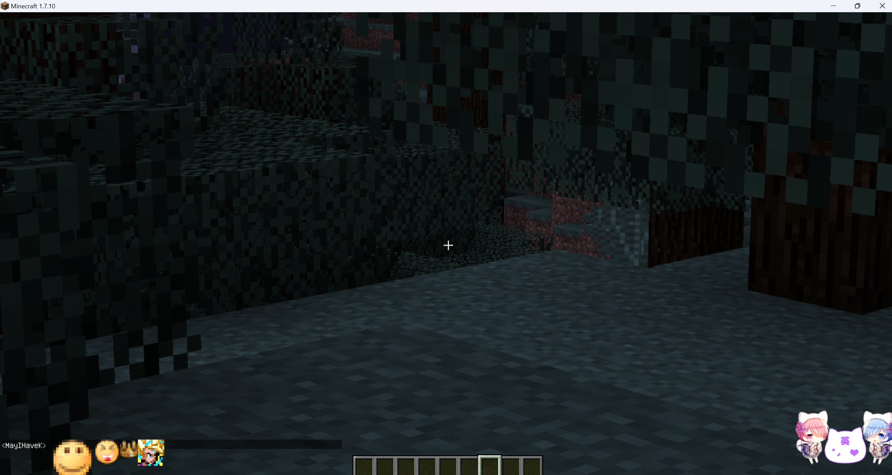
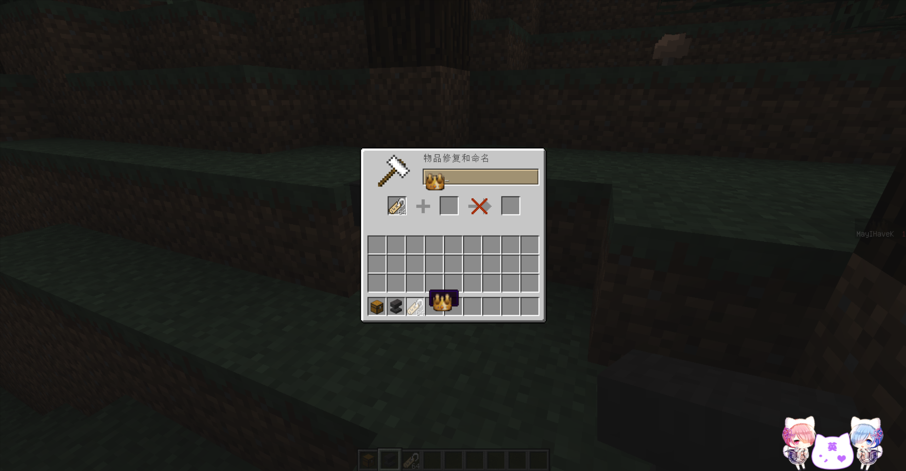
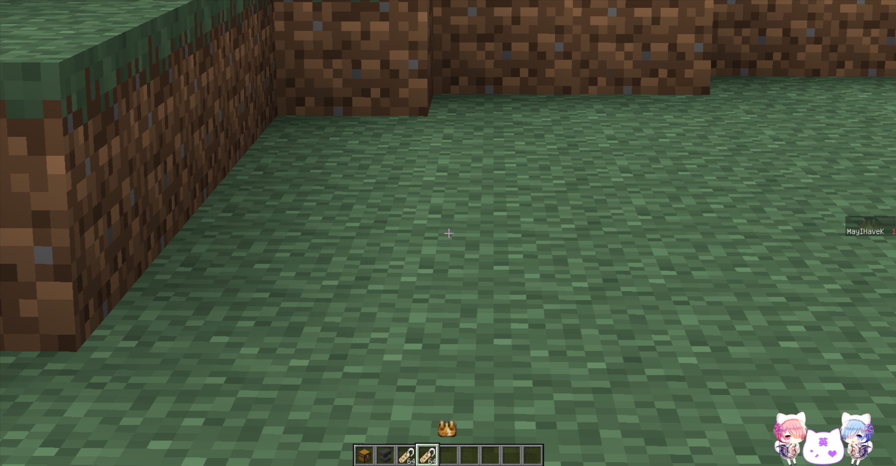
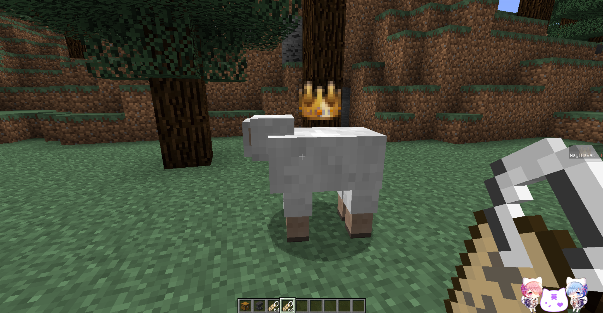
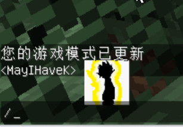

# 自定义表情 CustomEmoji

这个 mod 可以让你通过修改配置文件以及在Mod内添加资源，来制作可以在游戏中被使用的表情。

## 如何制作表情 CustomEmoji

制作表情的步骤如下：

1. 将 mod 使用压缩软件打开，找到 “assets\customemoji\textures” 目录，将表情需要使用到的贴图素材添加到其中(.png)。
2. 在 “。minecraft\config\" 目录下找到文件 ”customemoji.cfg“ 进行修改.

## 配置文件
~~~cfg
# Configuration file

general {
    # 自定义表情偏移 - 全局的X轴 [range: -100.0 ~ 100.0, default: 0.0]
    S:OffsetX=0.0

    # 自定义表情偏移 - 全局的Y轴 [range: -100.0 ~ 100.0, default: 1.0]
    S:OffsetY=1.0

    # 自定义表情列表 - 表情名:表情索引:显示的宽度:显示的高度:类型:(如果是gif需要填帧率) [default: [1:65537:32:32:png], [2:65538:16:16:png], [wd/6:65539:8:8:png], [dbc/73:65540:16:16:png], [gif/Run:65541:16:16:gif:10], [gif/Run2:65542:16:16:gif:10]]
    # 这里的 emoji_01 和 emoji_02 既是在游戏中使用的名称，同时也需要与对应的贴图素材名称保持一致。
    # 例如: 表情名为 emoji_01，贴图素材名为 emoji_01.png，则在配置文件中需要写成 emoji_01:65537。
    # 在游戏中使用为 :emoji_01:
    # 65537 是表情索引，用于 检测的，可以随意，但是不要低于 65536。
    # 32:32 是表情显示的宽度和高度，可以根据需要进行修改。
    # png 是表情类型，可以是 png 或者 gif
    # 如果表情类型是 jpg，则需要填
    S:emojiList <
        1:65537:32:32:png
        2:65538:16:16:png
        wd/6:65539:8:8:png
        dbc/73:65540:16:16:png
        gif/Run:65541:16:16:gif:10
        gif/Run2:65542:16:16:gif:10
     >

    # 自定义表情尺寸 - 高度 [range: 1.0 ~ 100.0, default: 9.0]
    S:height=9.0

    # 判断字符 - 用于判断是否为表情符号 [default: :]
    # 这里的 : 就是判断字符，在游戏中输入 :emoji_01: 即可显示表情。
    S:judgeChar=:

    # 自定义表情尺寸 - 宽度 [range: 1.0 ~ 100.0, default: 9.0]
    S:width=9.0
}
~~~

## 效果展示

